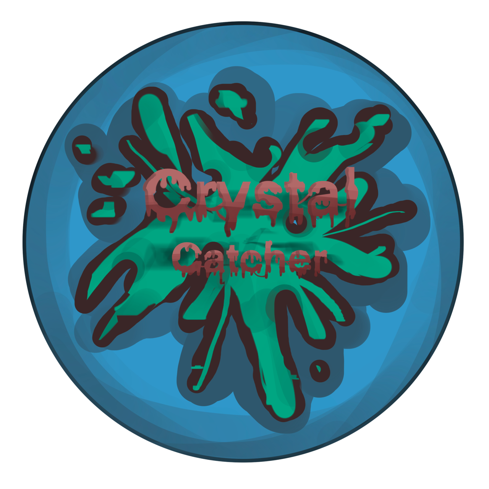

# Crystal Catcher

Crystal Catcher is a 2D computer game developed in Java. The purpose of the game is to collect the crystals (the game's coins) scattered around the map, to do this the character must move in the surrounding scenario by jumping from one platform (floating block of rock) to another, avoiding falling into the void.
This is a school project developed for the "Student's Masterpiece".

## Authors

- [@Lorenzo Venturino](https://www.github.com/loryventx99)
- Stefano Fiore
- Gabriele Andreani
- Daniel Aguilar Chumpitaz
